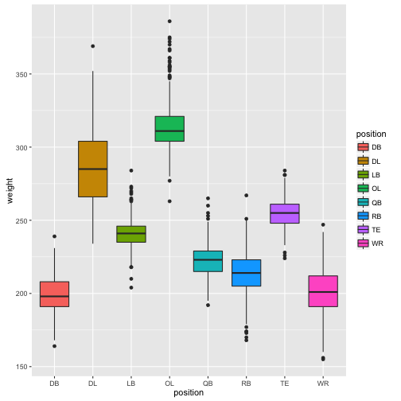
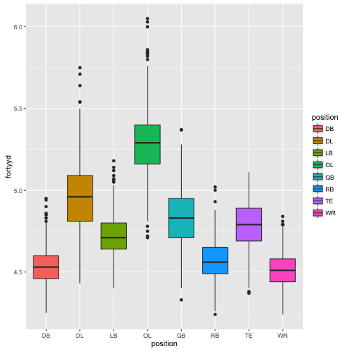

Predicting NFL Player Position
========================================================
author: Christopher Castle
Developing Data Products - Course Project

Concept
========================================================

- This Shiny App will use decision trees to predict an American Football player's position based on a few physical attributes and a binary value which signifies whether they are offensive or defensive players. 
- We'll use data from the NFL combine which is an event for measuring the physical attributes of potential NFL draftees. 
- We believe there is enough variation among players' heights, weights and 40 yard dash times to create a reasonably accurate decision tree. 


Players' Weights by Position
========================================================
left: 65%


***
<small>The variable with the most variation is weight. We can see that the heaviest outlier at wide receiver (WR) is still smaller than the lightest outlier on the offensive line (OL).</small>

Players' Forty Yard Dash Time by Position
===============================
left: 65%

***
<small>Weight is important to lineman, but speed is equally important to receivers and defensive backs. We can see they nearly mirror each other. We've included an offensive/defensive distinction in our data set to deal with this mirroring. </small>

Players' Average Heights by Position
========================================================


```
      DB       DL       LB       OL 
71.83517 75.47793 73.82653 76.69301 
```

```
      QB       RB       TE       WR 
74.89350 70.75522 76.36770 72.89085 
```
- We can see that tight ends (TE) are nearly as tall as offensive lineman while the previous slides showed they were much lighter and faster on average. 
- Our Shiny App provides an interesting quantitative example of the importance of physical attributes to American Football players' positions.
